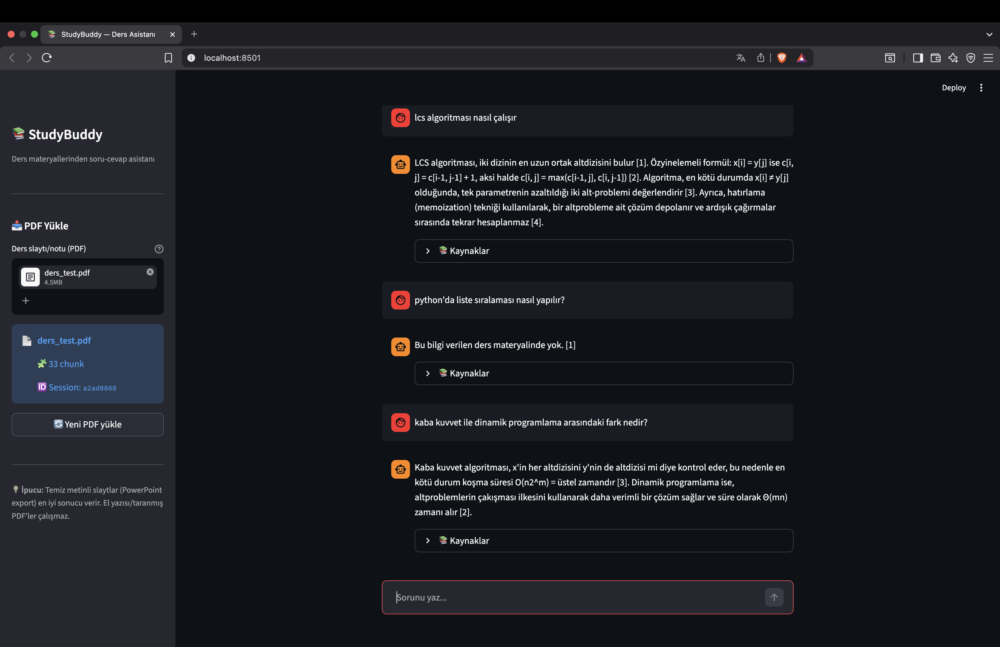
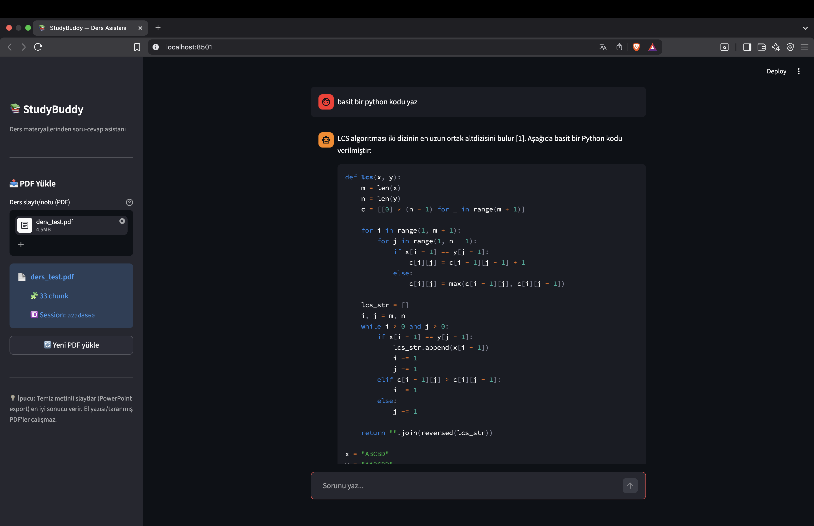
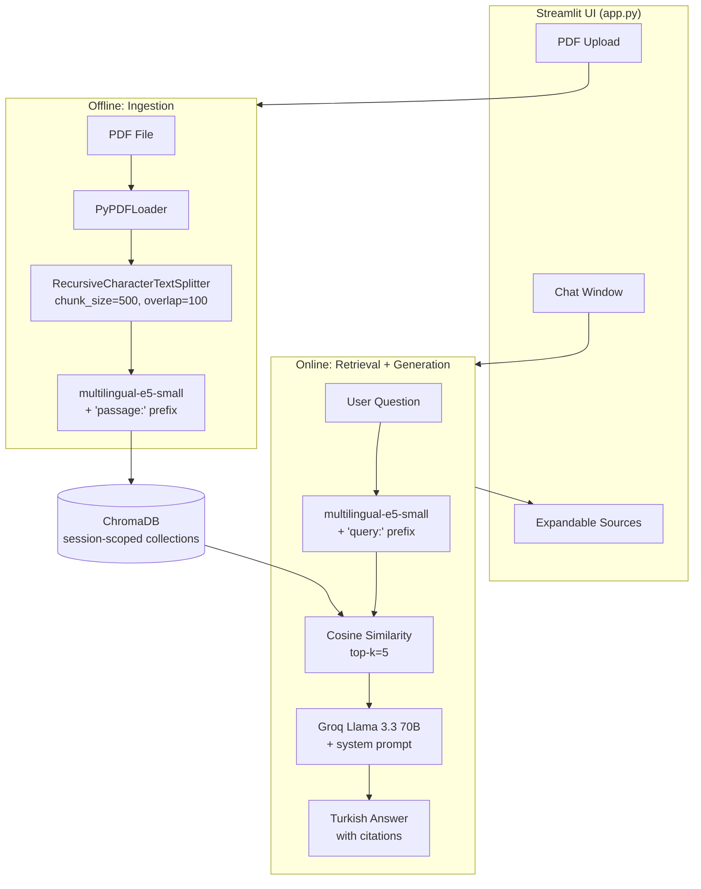

# StudyBuddy RAG 📚

> A Retrieval-Augmented Generation (RAG) assistant for Turkish-language lecture materials.
> Upload a PDF, ask questions, get cited answers — all grounded in your own course content.

**Live demo:** [🚧 Deploying to Hugging Face Spaces — link coming soon]

**Stack:** Python · LangChain · ChromaDB · sentence-transformers (multilingual-e5) · Groq (Llama 3.3 70B) · Streamlit

---

## Why This Project

Turkish university students often rely on lecture slides and handwritten notes that are scattered across semesters. Searching them during exam week is painful: no indexing, no full-text search, no summarization.

StudyBuddy solves this by letting students upload their own PDFs and chat with them in Turkish. Answers are grounded in the actual slides, with page-level citations — so the student can verify every claim.

The system is intentionally **Turkish-first**: embedding model, LLM, and prompt engineering are all tuned for Turkish content.

---

## Demo

### Core capabilities



A single session demonstrates three behaviors:

1. **Grounded answer with citations** — *"LCS algoritması nasıl çalışır"* returns a Turkish explanation with the recursive formula and inline `[1][2][3][4]` markers pointing to specific slides.
2. **Out-of-domain rejection** — *"python'da liste sıralaması nasıl yapılır?"* is refused with *"Bu bilgi verilen ders materyalinde yok."* The system does not fall back to its pretraining knowledge.
3. **Multi-hop reasoning** — *"kaba kuvvet ile dinamik programlama arasındaki fark nedir?"* synthesizes two separate sections of the source material into a comparative answer with complexity analysis (`O(n·2^m)` vs `Θ(mn)`).

Every answer has an expandable **Kaynaklar** section showing the retrieved chunks with file name, page number, and similarity distance.

### Known failure mode



Asking *"basit bir python kodu yaz"* (no algorithm name) produces a working Python implementation of LCS without any citation at all. The model internally treats pseudocode-to-Python translation as a "helpful transformation," not a hallucination — and prompt-only guardrails cannot reliably override this.

This is a genuine limitation, not a bug. The fix is a post-generation LLM-as-judge step (see [Known Limitations §1](#1-cross-language-hallucination-survives-broad-prompts) below).


## Architecture



### Request lifecycle

1. **Ingestion (offline, per PDF):**
   PDF → `PyPDFLoader` → `RecursiveCharacterTextSplitter` (chunk_size=500, overlap=100) → `multilingual-e5-small` embeddings (with `passage:` prefix) → ChromaDB collection scoped to session UUID.

2. **Retrieval (online, per query):**
   User question → `query:` prefix → embedding → cosine similarity in ChromaDB → top-5 chunks with metadata (source, page, distance).

3. **Generation (online, per query):**
   Retrieved chunks are formatted with numeric citation markers `[1]…[5]`, combined with a strict system prompt, and sent to Groq Llama 3.3 70B. The LLM produces a Turkish answer with inline citations.

4. **Session isolation:**
   Each browser session gets a unique ChromaDB collection name (`session_<uuid>`). Users never see each other's uploads, and multiple PDFs can be tested per session by clicking "Yeni PDF yükle".


## Design Decisions

Every component has an alternative. These are the ones I picked, and why.

### Embedding model: `intfloat/multilingual-e5-small`

- **Turkish support:** Most popular English models (`all-MiniLM-L6-v2`, `bge-small-en`) degrade badly on Turkish. E5 multilingual was trained on 100+ languages including Turkish.
- **Size:** 384 dimensions, ~120MB — runs on CPU at usable speed.
- **Asymmetric prefixes:** E5 requires `passage:` for documents and `query:` for questions. Retrieval quality drops ~10-15% if you skip this. Both prefixes are handled explicitly in code.

Alternatives considered: `bge-m3` (better quality, 3x slower), OpenAI `text-embedding-3-small` (paid, privacy concerns for student data).

### LLM: Groq Llama 3.3 70B

- **Turkish fluency:** Llama 3.3 handles Turkish well — better than Mistral 7B, roughly on par with GPT-4o-mini for this language.
- **Free tier:** Generous for demos (30 req/min, 14K tokens/day).
- **Speed:** Groq's hardware gives ~500 tokens/sec — responses feel instant.

Alternatives: Gemini 2.0 Flash (also free, fallback path), local Ollama (too slow for demo).

### Vector store: ChromaDB

- **Zero ops:** Persistent SQLite + HNSW index out of the box.
- **Metadata filtering:** Needed for per-session isolation.
- **Local-first:** Student PDFs never leave the machine (except for LLM calls).

Alternatives: FAISS (no metadata store without extras), Pinecone (paid, cloud-only).

### Chunking: `RecursiveCharacterTextSplitter`, 500 chars / 100 overlap

Tested 256 / 512 / 1024. 256 lost context across paragraphs; 1024 brought irrelevant content and hurt precision on the test corpus (MIT 6.046J slides, Turkish translation). 500 was the sweet spot for PowerPoint-export PDFs (typical chunk landed on slide boundaries).

### No LangChain abstraction over retrieval

I use LangChain's document loaders and ChromaDB wrapper (they save real code), but the retrieval and generation pipeline is orchestrated manually in `retrieval.py` and `llm.py`. High-level abstractions like `RetrievalQA.from_chain_type` hide the query rewriting, prompt construction, and citation parsing — which are the parts you actually need to debug and tune.

---

## Prompt Engineering

The system prompt went through three iterations. Each one fixed a specific failure mode I observed while testing.

### Iteration 1 — naïve
> *"Answer based on context. Cite sources like [1]."*

**Problem:** The LLM gave bulk citations (`[1][2][3][4][5]` on every sentence) and added unnecessary intro/outro paragraphs ("According to the sources..."). Answers were technically correct but sloppy.

### Iteration 2 — with structural rules
Added: *"ONE citation per specific claim. No intro/conclusion paragraph. Don't repeat."*

**Problem:** The bulk-citation issue was fixed. But when asked *"LCS algorithm in Python?"* the LLM translated the pseudocode to Python and cited a slide that contained no Python at all — **citation hallucination**.

### Iteration 3 — with few-shot negative examples
Added: *"If CONTEXT has pseudocode and the user asks for Python/Java/C++, say it's not available and return the pseudocode as-is. Cross-language translation counts as hallucination."*

**Result:** Direct "Python version of LCS?" queries are correctly rejected and pseudocode is returned. **However, the guardrail is still prompt-only** — see Known Limitations below.

---

## Known Limitations

### 1. Cross-language hallucination survives broad prompts

**Example:** Asking *"write me a simple python code"* (no algorithm name) causes the LLM to pick LCS from context and produce a full Python implementation without citations. The iteration-3 prompt protects specific phrasings but not broad ones.

**Why this is hard to fix at the prompt layer:** The LLM internally considers pseudocode-to-Python translation a "helpful transformation," not a hallucination. Soft prompting cannot reliably override this.

**Real fix:** Post-generation LLM-as-judge step (cost: +1 LLM call per response, +2x latency). Planned for a future version.

### 2. Math-heavy / LaTeX-derived PDFs parse poorly

PDFs compiled from LaTeX often embed formulas as custom glyph codes (`(cid:73)`) and lose word boundaries. Retrieval still works semantically, but the returned text is hard to read. PowerPoint-export PDFs are the recommended input format.

**Real fix:** PyMuPDF4LLM or Nougat for LaTeX-aware extraction.

### 3. Scanned / handwritten PDFs are not supported

No OCR layer. PDFs without a text layer are silently ingested as empty — retrieval returns nothing useful. This is called out in the sidebar tip.

### 4. No evaluation harness yet

Retrieval quality is currently judged by eye. A 20–30 question ground-truth set with `hit@k` / `MRR` / latency metrics is the immediate next step.

---

## Project Structure

| Path | Purpose |
|------|---------|
| `app.py` | Streamlit UI — multi-session chat interface with PDF upload |
| `src/studybuddy/config.py` | Environment variables, paths, hyperparameters (chunk size, top-k, temperature) |
| `src/studybuddy/ingestion.py` | PDF → chunks → embeddings → ChromaDB pipeline |
| `src/studybuddy/retrieval.py` | Query → top-k chunks with metadata (dataclass-based) |
| `src/studybuddy/llm.py` | Groq wrapper + prompt template + answer formatting |
| `scripts/test_retrieval.py` | Debug script for manual retrieval inspection |
| `data/uploads/<session>/` | User-uploaded PDFs (gitignored, session-scoped) |
| `data/chroma/` | Persistent ChromaDB storage (gitignored) |
| `docs/` | Screenshots and architecture artifacts |
| `pyproject.toml` | uv-managed dependencies (LangChain, ChromaDB, Streamlit, etc.) |

## Setup

Requires Python 3.11+ and [uv](https://docs.astral.sh/uv/).

**Clone**

```bash
git clone https://github.com/ardapalas/studybuddy-rag.git
cd studybuddy-rag
```

**Environment**

```bash
uv venv
source .venv/bin/activate
uv sync
```

**Configure**

```bash
cp .env.example .env
```

Then add your Groq API key to `.env` (free tier at https://console.groq.com).

**Run**

```bash
streamlit run app.py
```

First launch downloads the multilingual-e5 embedding model (~470 MB, one-time).

## Testing Notes

Manual tests I ran on MIT 6.046J Turkish slides (31 pages, 33 chunks):

| Test type                  | Query                                              | Result       |
| -------------------------- | -------------------------------------------------- | ------------ |
| Semantic matching          | *"Altproblemlerin üst üste binmesi ne demek?"*     | ✅ Pass       |
| Multi-hop reasoning        | *"Kaba kuvvet vs dinamik programlama farkı?"*      | ✅ Pass       |
| Specific detail retrieval  | *"Kaba kuvvet algoritmasının zaman karmaşıklığı?"* | ✅ Pass       |
| Out-of-domain rejection    | *"Python'da liste nasıl sıralanır?"*               | ✅ Pass       |
| Cross-language translation | *"LCS Python'da nasıl kodlanır?"*                  | ⚠️ See §1 |

---

## Stack Details

| Layer       | Tool                             | Version |
| ----------- | -------------------------------- | ------- |
| Language    | Python                           | 3.11    |
| Package mgr | uv                               | 0.5+    |
| LLM         | Groq Llama 3.3 70B               | —       |
| Embeddings  | intfloat/multilingual-e5-small   | 384d    |
| Vector DB   | ChromaDB                         | 1.5+    |
| Orchestr.   | LangChain                        | 0.3+    |
| UI          | Streamlit                        | 1.38+   |

---

## License

MIT

Built by Arda Palas · [GitHub](https://github.com/ardapalas) · [LinkedIn](https://linkedin.com/in/ardapalas)
